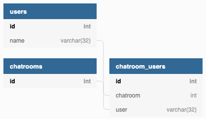

# System Architecture:

# System Design:
* Use **websocket** to establish the long connection between server and client.
* Use **Redis** as chat room's **Pub/Sub broker** to broadcast messages to multiple servers.
* For scalability, instead of redirecting users of same chat room to a single server, by utilizing Redis's Pub/Sub broker we can distribute users of the same chat room to multiple servers. This will prevent users from accessing to a single server if the chat room is a hot data (ex: celebrity's chat room).
  * Ex: Users of **'Chat room A'** may be distributed to **'App Server 1'**, **'App Server 2'** and **'App Server 3'**.

* To simply the design, users are distributed to multiple severs based on their *username* (or *user_id*) by hashing.
* Use **Elasticsearch** to save chat logs for playback.

# Components:
* Chat server:
  * Provide chat room service.
  * Broadcast messages to users in the same chat room.
* Load balancer: Nginx (Not actually deployed in this project.)
  * To distribute requests to multiple servers.
* Cache: Redis
  * Cache list of chat rooms.
  * Cache users list of each chat room.
  * Reduce read traffics to database.
* Publish/Subscribe broker: Redis
  * Each chat room on different servers are subscribing to the same channel. When either a chat room has a new message, the message will be published to the broker and broadcast to all the subscribers (chat rooms).
  * Use to broadcast the messages between each chat room on multiple server
* Database: MySQL
  * Persistence storage for chat room and user information.
* Chat logs storage: Elasticsearch
  * Save chat logs to playback the history messages when a user joins a chat room.
  * Comparing with MySQL or other RDBMS, Elasticsearch can support larger concurrent traffics and better scalability. Since transactions and strong consistency are not required for chat logs, storing chat logs to Elasticsearch instead of MySQL would be a better option.
  * Besides, we can use Elasticsearch to provide chat logs search in the future.

# API:
* Get chat rooms list:
  * **(GET) /v1/chatrooms**:
* Create chat room:
  * **(POST) /v1/chatrooms**
* Get users list of chat room:
  * **(GET) /v1/chatrooms/{chatroom-id}/users**
* Create user:
  * **(POST) /v1/chatrooms/users**
    * Request JSON Body: { "name": *&lt;user name&gt;* }
* Join chat room:
  * **(GET) /v1/chatrooms/{chatroom-id}/join?user=*&lt;user name&gt;***

# Database schemas (MySQL):

# Elasticsearch index mapping template:
* **chatroom**: interger
* **user**: keyword
* **message**: text
* **timestamp**: date (epoch_millis)
    * See **migrations/elasticsearch/1563031407/messages_template.json** for details.

# Future Improvements:

## Fault tolerance:
* Data inconsistency between cache and database:
    * Some data (ex: chat room's list; users list of each chat room) are also stored in Redis cache to reduce , but data inconsistency may happen when: **'Successfully update database but fail to update cache'**.
    * Set expire time on cache entries may reduce the time of data inconsistency.
* Currently, **chat room <-> user's relations** (i.e. chat room users list) are storing in MySQL. Once a user leave chat room or disconnect from server, server will remove the relation of that user. However, if server crashes, there's no way to remove these relations now.
    * Set up a background job task to clean up the nonexistent relations periodically may help.
* Server crash:
  * What if a server crash? All the connections will be lost.
  * Client side should be responsible to reestablish the connection (which would connect to another healthy server thanks to load balancer) and rejoin chat room for users.

## Sudden traffic spikes:
* Auto scaling should be implemented to avoid sudden traffic spikes.
* Sudden traffic spikes may also happens when a server crash, which will cause all users on the crashed server to reestablish connections. Elasticsearch will also received lots of **'retrieve history messages'** requests, too.
    * Cache the history messages of each chat room for a short period might help. Also it may introduce data inconsistency (ex: Other user chat something at the same moment history messages are been loaded), however it might be acceptable.
    * Block users of the same chat room from requesting Elasticsearch for the history messages at same time until cache is been loaded to Redis or local memory.
        * Prevent sudden query requests spike to Elasticsearch.

## Security:
* Currently, any user can login to a chat room if he/she knows other user's username.
  * User authentication should be implemented.
* SSL in not implement in this project, which should be implement for the real product.

# Installation:
* Please see **README.md** under project's root directory.
